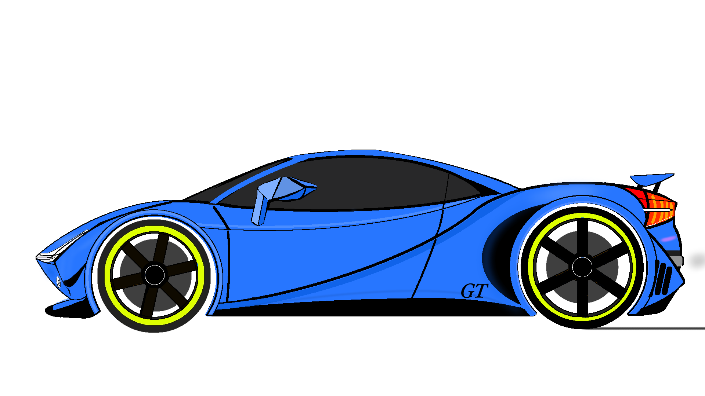

<iframe width="566" height="315" src="https://www.youtube.com/embed/6cpAntVdFag" title="YouTube video player" frameborder="0" allow="accelerometer; autoplay; clipboard-write; encrypted-media; gyroscope; picture-in-picture"
allowfullscreen></iframe>

# 自己紹介

## 基本情報
情報システム/CS系の大学生（2028年卒予定）。就活では PdM・事業企画・AI基盤系の職種を中心に、AIネイティブ企業や外資系日系企業、事業会社のインハウス職を志望中。

## 専門・取り組み
個人開発で PLAMA という AI関連プロジェクトを継続中（Next.js + FastAPI + LangGraph構成）。設計思想は「性悪説ベース設計」で、善意に依存せず機能するシステムを作ることを軸にしてる。Why/Whatの設計力は強いけど、How層（インターフェース仕様）を省略しがちなのが自覚してる弱点。

## 趣味
- **ロードバイク**: GIANT ESCAPE R3とFuji SL-A 1.3を1xドライブトレインに改造、ホイール組みも自分でやる
- **GT7**: 三菱GTOでニュルブルクリンク北コース専走、PB 6:52.786
- **IEM収集**: 28機種16ブランド所有、弱ドンシャリ傾向
- **SF小説**: カクヨムで執筆中
- **LEGO Technic**: MOC設計

## スタンス
情報収集は得意分野（LLM、自転車、就活）では一次情報まで深く調べる一方、未知の分野では探索が浅め。長期的には「AIが実行を自動化する時代に、問題定義・評価基準設計の側に立つ」ことを目指してる。

---
